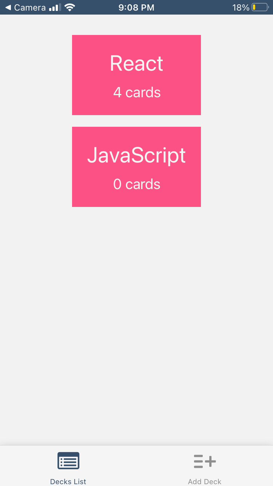
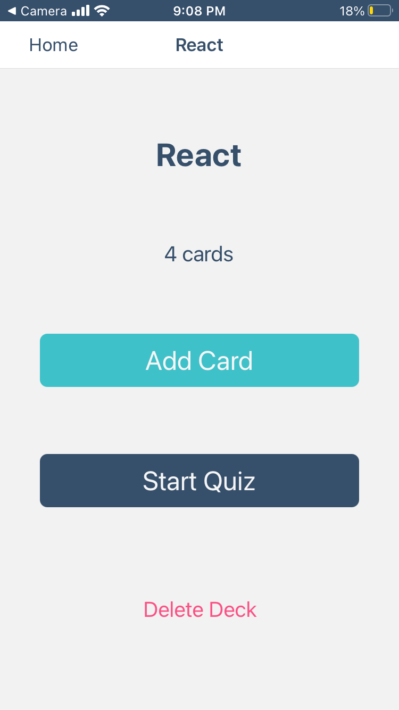
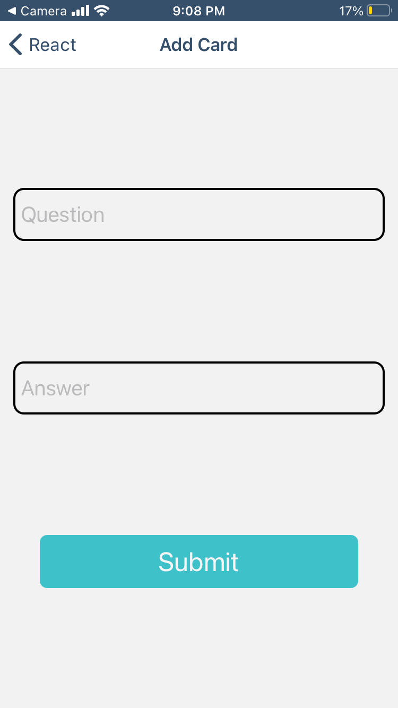
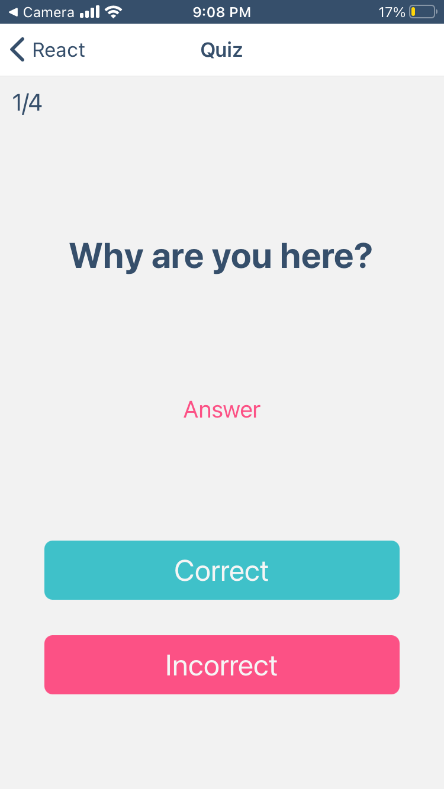

# mobile-flashcards Project

This is the project for Udacity's React-Native course. The Mobile Flashcards app is built for students to quiz themselves, review the questions, and help them to better memorize what they've learned.
I build a React-Native Front-End for the application. I used [Create React Native App](https://github.com/expo/create-react-native-app), [Redux](https://redux.js.org/), [React Navigation](https://reactnavigation.org/), [Async Storage](https://react-native-async-storage.github.io/async-storage/) and [Expo](https://docs.expo.io/) for this project.
This app is tested on the ios Platform and website.

## App view

### Deck List View
The user can see a list of decks or a text that asks them to add some decks when they first open the app.They can click a deck to go to the deck view.

### Deck View
In the deck view, user can see the title and total cards for this deck. There is a button to add a card and a button to start a quiz.

### Add Card View
There is 2 inputs for question and answer, user can click the submit buttom to create a new card.

### Quiz View
In the quiz view, there is the question, user can click the correct or incorrect button to log the correct counts, they can also flip the text button to see the answer or the question. At the end of the quiz, it shows how many times the user answered correctly, a button to restart the quiz, and a button to go back to the beck view.

## Get Started

* To get this project, type `git clone https://github.com/cheerworld/mobile-flashcards.git` in your terminal.

To get started developing right away:

* install all project dependencies with `npm install/yarn add`
* start the development server with `npm/yarn web` for the web view, you can also scan the code provided by expo to run the app in your mobile device, but you need to install expo app in your phone.
You can get [Expo App for Iphone](https://apps.apple.com/us/app/expo-client/id982107779), or get [Expo App for Android](https://play.google.com/store/apps/details?id=host.exp.exponent).

### Have fun with the Mobile Flashcards App!
